# 🍓 ICHIGOMusic

**融合精致设计与极致声画体验的网易云音乐第三方桌面客户端**

*全屏沉浸式动态歌词 · 灵动悬浮桌面歌词 · 音频频谱可视化 · 双界面布局架构 · 局域/远程多人实时一起听 · 智能混洗心动模式*

---

## 核心特性

- **双布局架构**：经典侧边导航与现代流线毛玻璃卡片布局自由切换。
- **全景沉浸模式**：提供 7 款各具特色的全屏动效舞台（常规逐字、PV 动效、气泡、云阶、空间画布、黑胶与胶片模式）。
- **悬浮桌面歌词**：三行滚动排版、主歌词逐字动画、翻译歌词联动、文字辉光特效与鼠标穿透锁定。
- **智能心动模式**：基于红心曲库真随机混洗，并以 2:1 黄金比例动态穿插智能推荐好歌。
- **多人实时一起听**：生成专属房间链接，支持毫秒级播放进度同步、聊天互动与剪贴板极速识别。
- **多级解灰与全网音源**：内置 UNM 智能解灰机制与全网音源智能匹配，保障曲库完整播放体验。
- **高保真音频与可视化**：支持多档音质切换、多款动态频谱渲染，以及官方听歌时长与播放记录实时同步。

---

## 界面与功能展示

### 双布局界面设计

ICHIGOMusic 提供两套精心打磨的界面交互形态，可在设置中随时无缝切换。

#### 经典布局 (Classic Layout)
侧边导航清晰明确，歌单分类与推荐流一目了然，传承经典桌面音乐播放器的直觉操作。

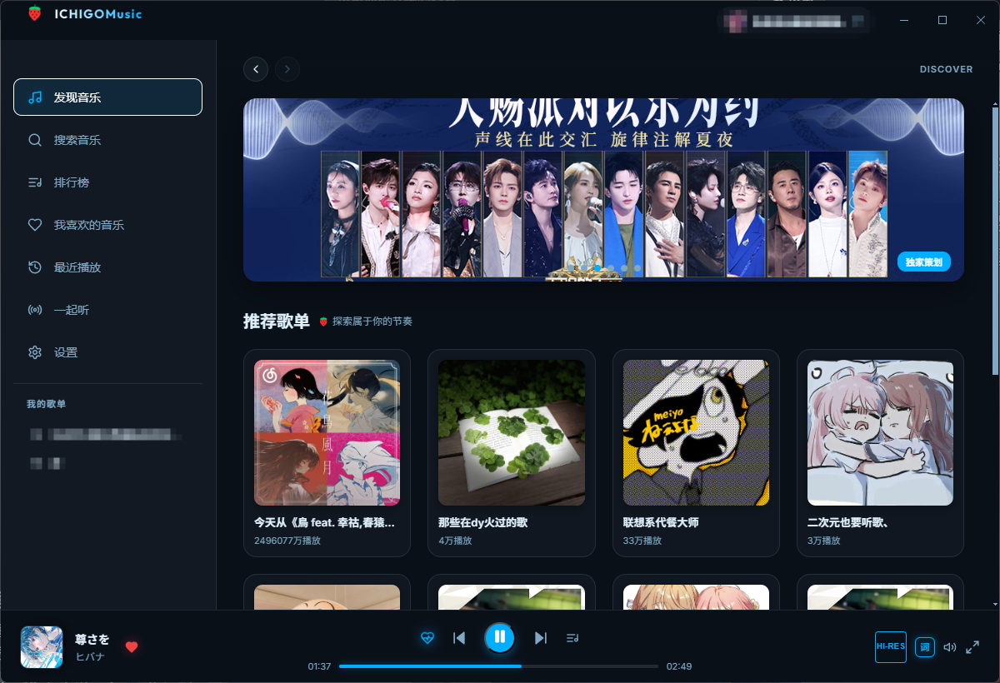

#### 现代布局 (Modern Layout)
全景毛玻璃质感、灵动圆角浮动底栏与极简流线排版，带来更加轻盈通透的视觉体验。

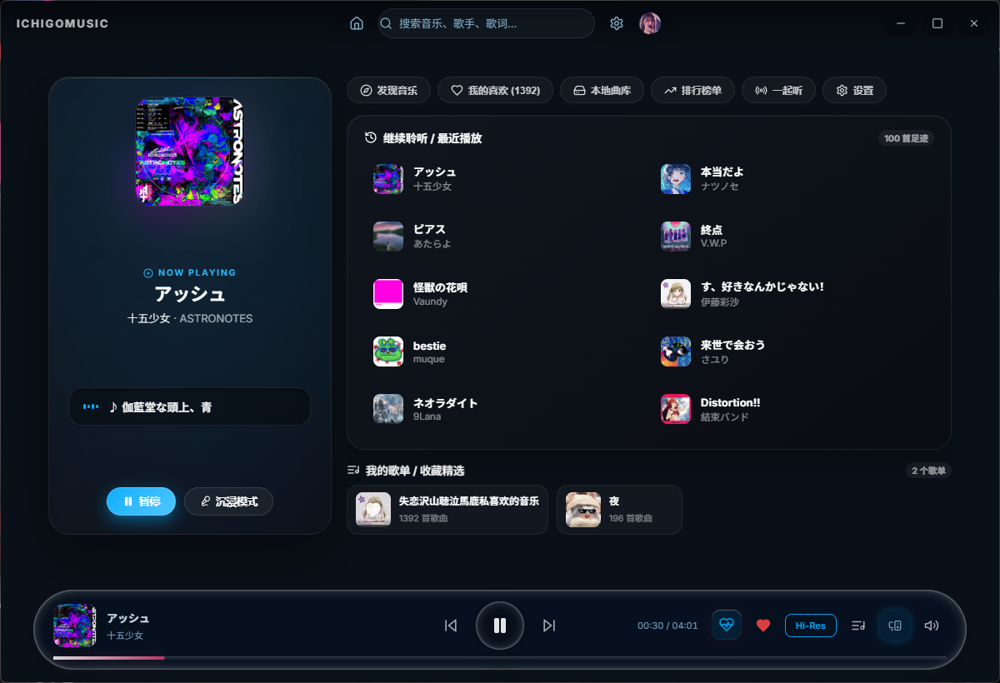

---

### 全屏沉浸歌词系统

点击播放栏封面或全屏按钮即可进入沉浸模式。系统内置 7 款精心调校的沉浸视觉风格，支持专辑主色提取、动态光影模糊、多种视觉粒子及丰富的排版动画：

#### 1. 常规逐字模式
经典优雅的逐字平滑过渡，配合基于专辑封面主色调生成的呼吸光影与柔和渐变。

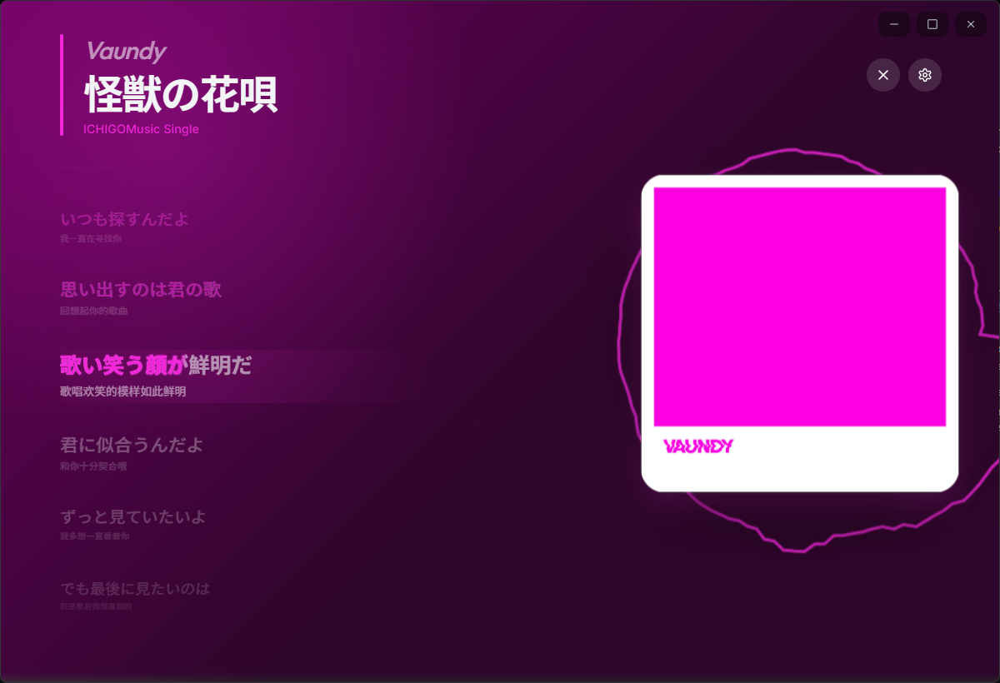

#### 2. PV 动效模式
结合艺术字排版、动态镜头拉伸、节奏震颤与背景氛围渲染，呈现 MV 级的视听沉浸感。

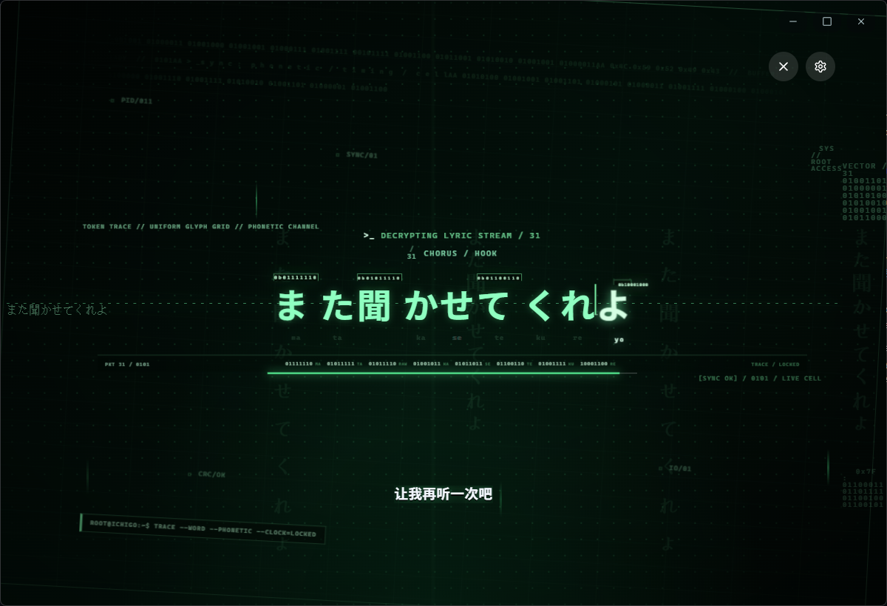

#### 3. 气泡模式
将当前演唱歌词包裹于半透明轻盈气泡中，层次分明，带来生动有趣的视觉律动。

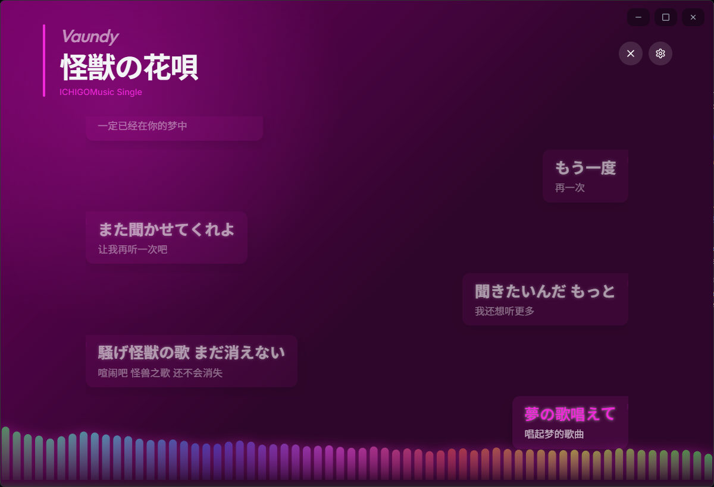

#### 4. 云阶模式
立体的云阶层级透视与景深动效，歌词逐级上下滚动如行云流水般平顺。

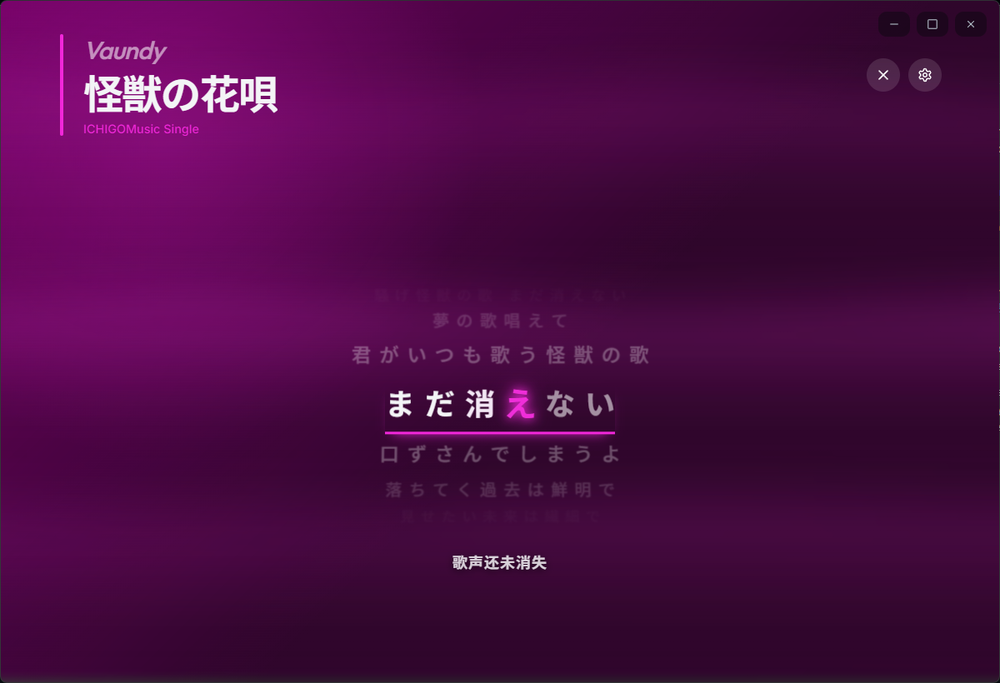

#### 5. 空间画布模式
广阔深邃的画布空间感，当前句与背景层次分明，营造沉浸专注的听歌体验。

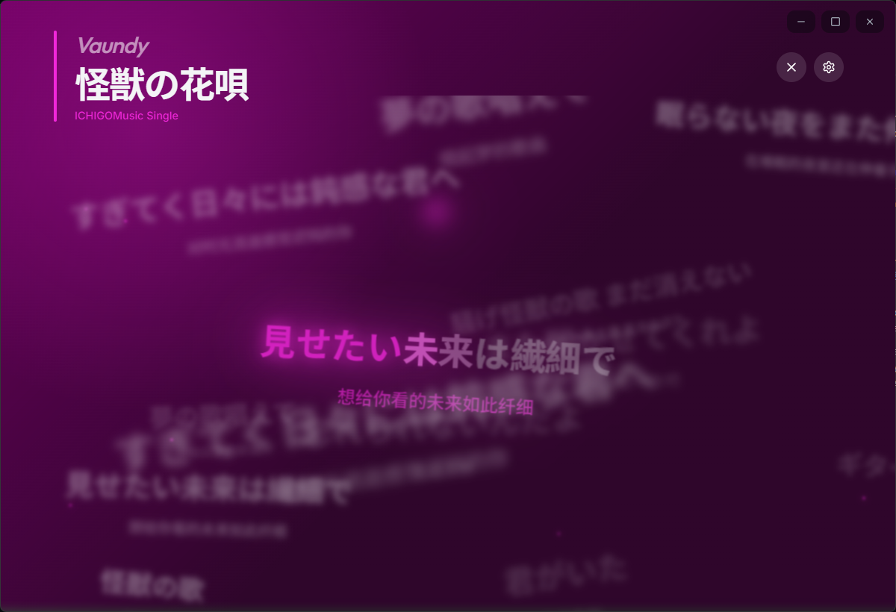

#### 6. 黑胶模式
经典的黑胶唱片旋转质感与唱针交互，复古质感与现代动态歌词完美融合。

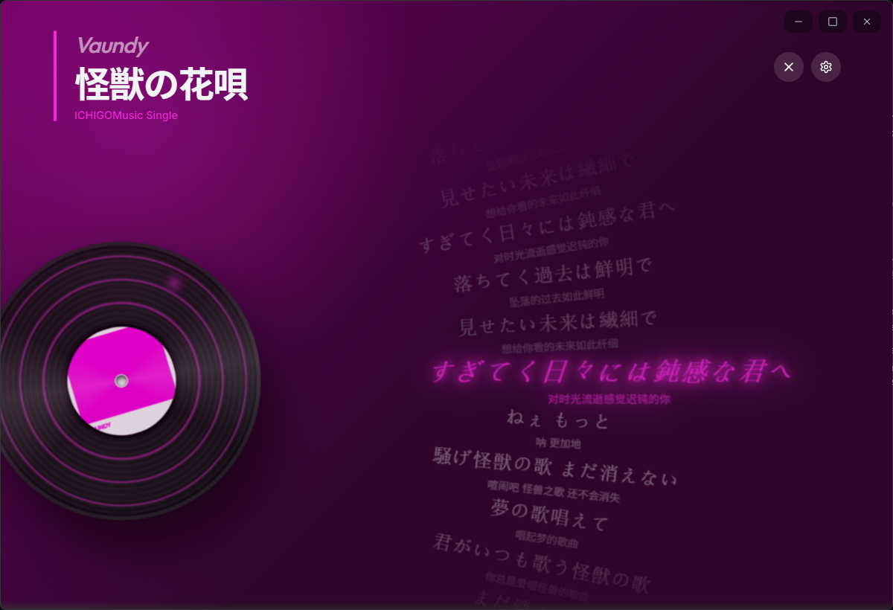

#### 7. 胶片模式
电影胶片质感的画幅风格与独特的复古颗粒光影，为音乐赋予浓郁的故事感。

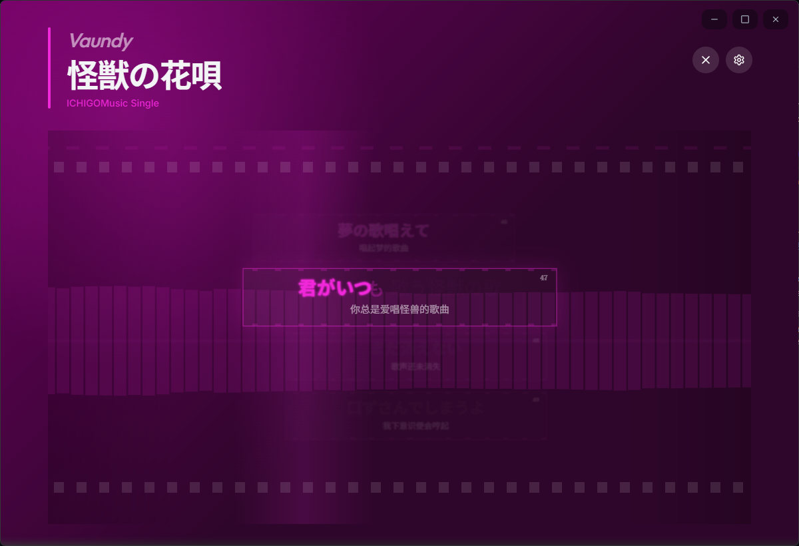

#### 沉浸参数深度调节
支持自由调节字号、行距、对齐方式、模糊强度、粒子特效及背景运镜速度。

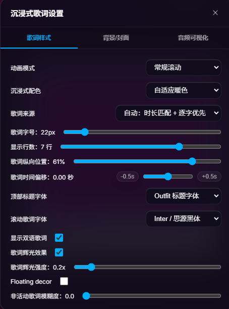

---

### 悬浮桌面歌词

无论是在工作、游戏还是浏览网页，桌面歌词均可悬浮于所有窗口之上，随心拖拽放置。

- 支持三行歌词显示、主歌词逐字动画与翻译歌词联动。
- 支持自定义字体、字号、颜色渐变、文字辉光与背景虚化。
- 具备窗口穿透与位置锁定功能，不干扰桌面正常操作。

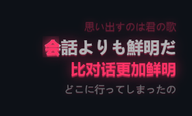

---

### 多人实时一起听

跨越距离阻隔，与好友共享同一首音乐的律动与情绪。

- **一键建房**：生成专属房间号与邀请链接，支持剪贴板自动识别并弹窗加入。
- **毫秒级同步**：房主掌控播放进度与切歌，成员端自动毫秒级校准同步。
- **内置交流面板**：房间内集成实时聊天模块，分享听歌感受与交流互动。

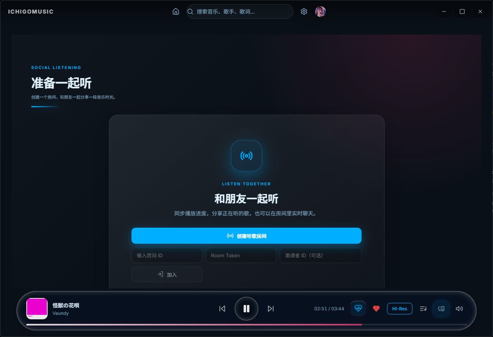

---

### 个性化定制与本地缓存

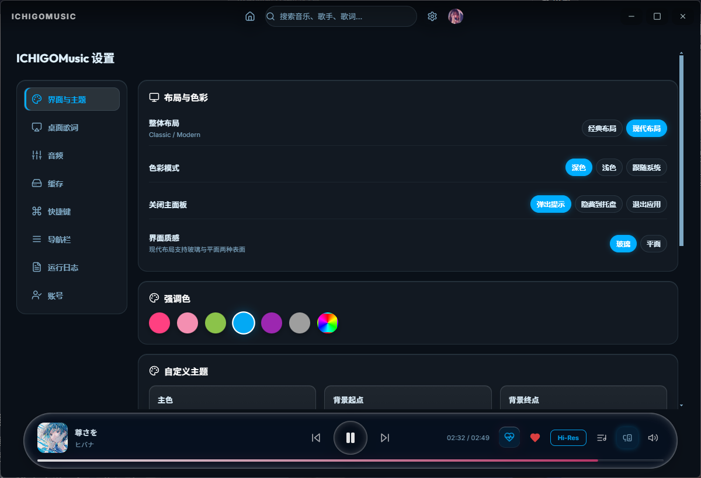

- **主题配色**：支持暗色/亮色模式智能跟随系统，内置多款定制主题色调。
- **高解析度音质**：支持标准、极高、无损 (FLAC)、Hi-Res 等多档音质切换。
- **智能本地存储**：支持自定义音频、封面及歌词的本地缓存路径与容量上限，提供一键清理管理。
- **系统级媒体集成**：支持 Windows 全局媒体快捷键、任务栏缩略图控制与托盘快速切歌。

---

## 快速上手

### 下载安装
前往 Releases 页面下载最新的 Windows 安装包（如 `ICHIGOMusic Setup 1.9.1.exe`），双击运行即可完成安装。

### 本地构建与运行

#### 环境要求
- Node.js (v18 或更高版本)
- npm / pnpm

#### 1. 克隆仓库并安装依赖
```bash
git clone https://github.com/lyb82ndkf-lab/ichigo-music.git
cd ichigomusic
npm install
```

#### 2. 启动开发环境
```bash
# 启动前端服务
npm run dev

# 启动 Electron 主窗口
npm run electron
```

#### 3. 构建发布包
```bash
npm run electron:build
```
打包输出的可执行文件将生成于 `release/` 目录下。

---

## 开源协议

本项目遵循 MIT License 开源协议。所有音乐及相关元数据版权均归网易云音乐及相关版权方所有，本项目仅供个人学习与技术交流使用。
